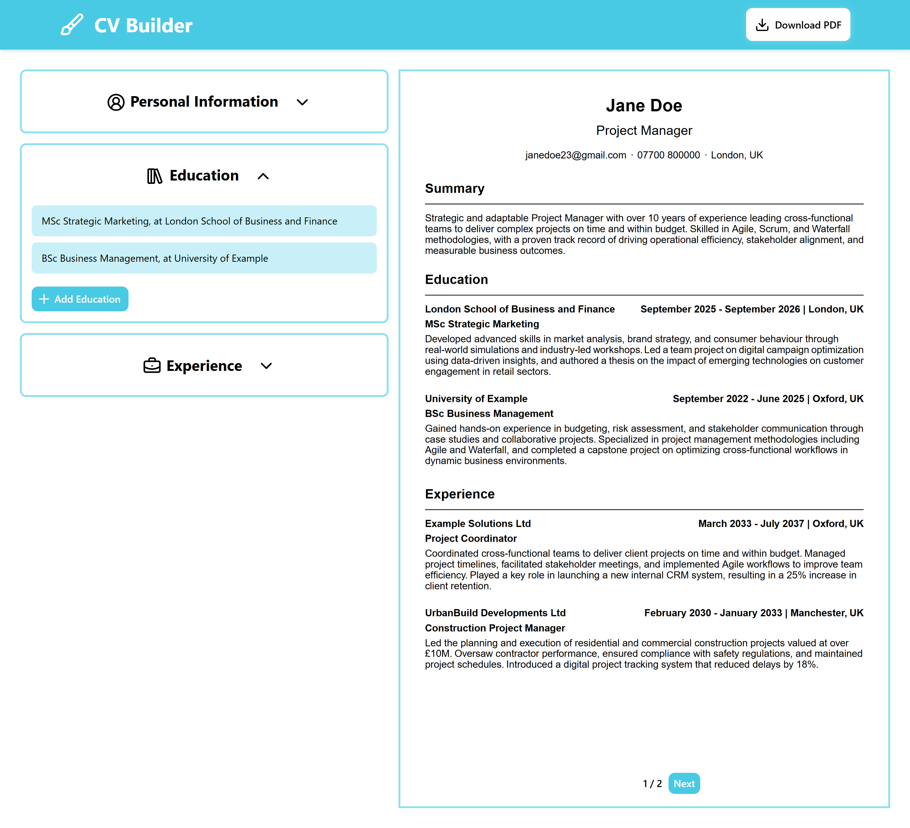
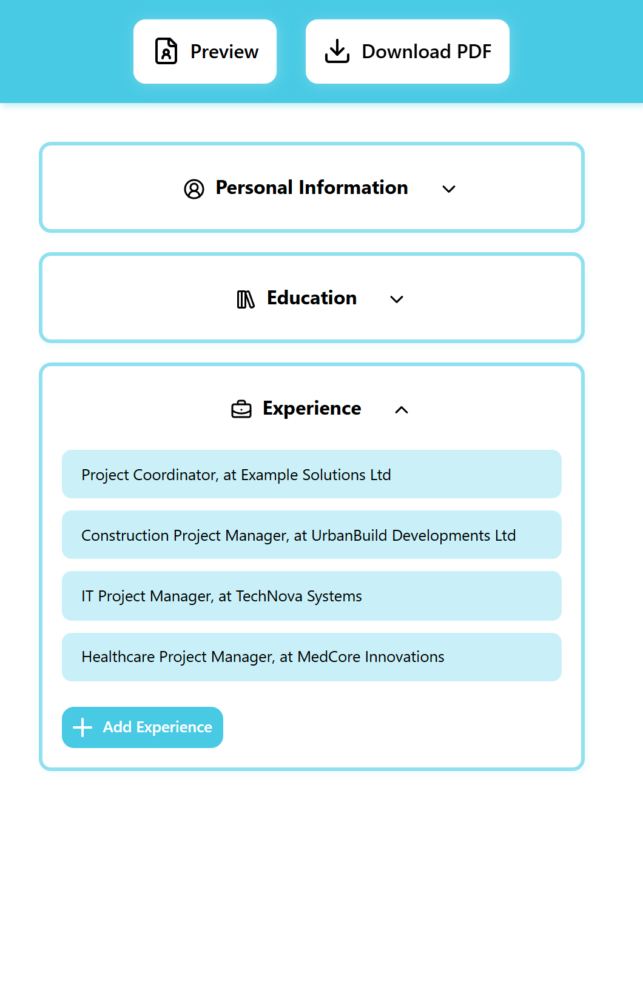
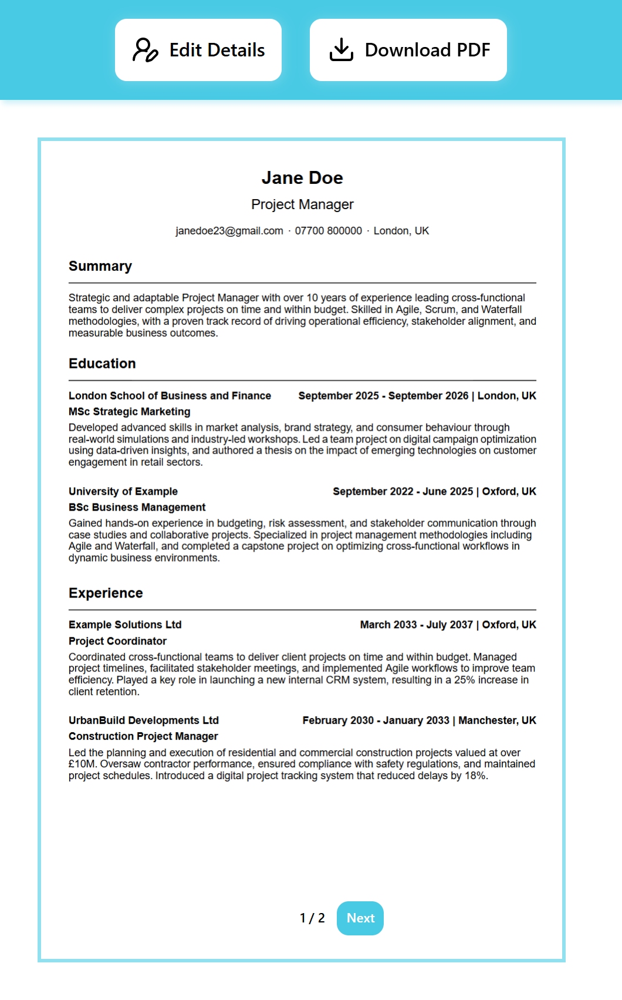

# CV Builder

## Introduction
A responsive CV Builder built with React, featuring live document preview, multi-page pagination and downloadable PDF.

## Features
* __Document Preview__: Preview your CV as you build it.
* __Pagination__: Navigate multi-page CVs with built-in page controls.
* __Downloadable PDF__: Download your finished CV in a clean, print-ready format.
* __Responsive Design__: Optimized for desktops, tablets, and mobile devices.

## Technologies Used
* React
* Vite
* Lucide (for icons)
* date-fns (for handling time formatting)
* react-pdf (for real-time document preview)
* @react-pdf/renderer (for PDF generation)

## Project Link
You can view this project [here](https://alexs1302-cv-builder.vercel.app/)!

## Project Interface (Screenshots)
### Desktop View

### Mobile view

## Credits
This project was created as part of The Odin Project's curriculum, a free online resource for learning web development.
